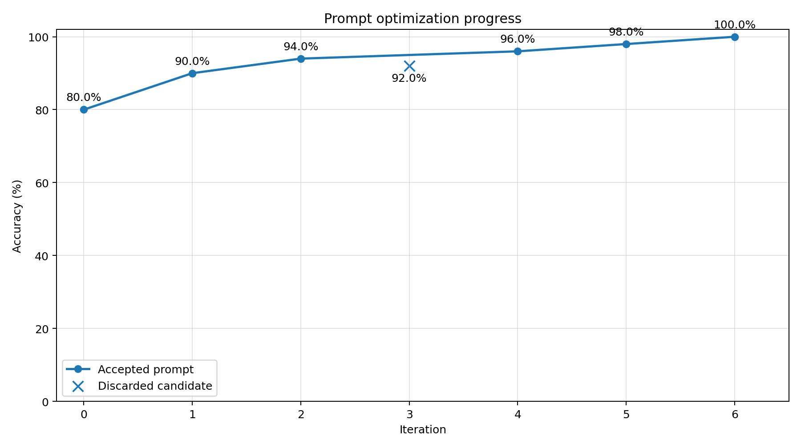

# Radiology Prompt Optimization Lab

This project is a teaching-ready prompt-optimization lab for AI Engineering students.

It demonstrates how to improve an LLM system prompt for radiology order normalization with a **three-agent architecture**:

1. **NormalizerAgent**: applies the current system prompt to a radiology order.
2. **FailureAnalyzerAgent**: inspects failed predictions and explains why they failed in a generalizable way.
3. **PromptOptimizerAgent**: rewrites the full normalizer system prompt based on the analyzed failures.

The project also includes a deterministic evaluator, memory, debug logging, local prompt versioning, and a reset script so students can restart the experiment from the baseline prompt at any time.

## Scenario

This lab simulates a realistic hospital-integration problem: radiology departments across different hospitals describe imaging orders in heterogeneous ways, and a central hospital information system must normalize them against a shared standard catalog.

The goal is not image interpretation or diagnosis. The goal is operational normalization: mapping free-text radiology orders to a canonical runtime catalog using an iterative, self-improving prompt optimization loop.

## Core design choices

This lab treats prompt optimization as a **two-stage reasoning problem**, not a direct rewrite from raw benchmark errors.

### 1. The normalizer prompt is the evolving artifact
The normalizer receives the **entire current system prompt** as its system message.  
Its user message contains only case-level runtime data:

- the free-text radiology order
- the runtime catalog

This makes the prompt itself the primary object being optimized and versioned across iterations.

### 2. Failures are analyzed before they are optimized
A central design choice is the use of a **FailureAnalyzerAgent** between evaluation and prompt rewriting.

Instead of asking the optimizer to read raw failed examples and patch them directly, the lab first converts each failure into a more reusable diagnosis, including:

- the failure category
- the likely policy gap in the current prompt
- a generalizable fix hint
- a leakage-safe summary of the failure pattern

This forces the optimization loop to operate on **abstract failure signals** rather than on benchmark-specific examples.

### 3. The optimizer rewrites policy, not examples
The optimizer has its own fixed system message and receives:

- the current system prompt
- analyzed failure summaries produced by the analyzer

Its job is to produce a **full replacement prompt** that improves decision policies at the rule level:
ambiguity handling, laterality reasoning, modality/contrast interpretation, exam intent preservation, candidate selection, and abstention behavior.

The goal is not to memorize benchmark cases, but to strengthen the prompt's general decision logic.

### 4. This architecture is intentionally anti-overfitting
The analyzer layer exists to reduce one-off patches and benchmark leakage.

Without that intermediate step, a prompt optimizer can easily overreact to a handful of failures and generate brittle instructions tied to literal examples.  
With the analyzer in the loop, the system is biased toward:

- reusable policies instead of case-specific fixes
- prompt-level reasoning improvements instead of lookup-table behavior
- safer optimization under repeated benchmark iteration

In short, the core idea of the lab is not just **prompt rewriting**, but **analyzer-mediated prompt rewriting**.

## Project structure

```text
benchmark/
  catalog.json
  dev.jsonl

prompts/
  normalizer/
    baseline_system_prompt.txt
    current_system_prompt.txt
    accepted/
    candidates/
  analyzer/
    system_message.txt
  optimizer/
    system_message.txt

results/
  debug_log.txt
  benchmark_profile.json
  optimization_trace.json
  accuracy_evolution.png
  predictions_iteration_*.json
  generated_prompts/

scripts/
  reset_lab.sh

src/
  run_lab.py
  radnorm/
```

## Installation

```bash
python -m venv .venv
source .venv/bin/activate
pip install -e .
```

## Configuration

Copy the example environment file if needed:

```bash
cp .env.example .env
```

## How to run

### Offline reproducible run

```bash
python src/run_lab.py --runtime mock --debug
```

### Real run (OpenAI)

```bash
python src/run_lab.py --runtime agno_openai --debug
```

## What the loop does

For each iteration, the lab:

1. evaluates the current Normalizer Agent system prompt
2. analyzes each failed case with the Analyzer Agent;
3. builds an optimizer payload containing the current prompt, dataset profile, metrics, and analyzed failures;
4. asks the Optimizer Agent to generate a new full system prompt;
5. rejects leaked or benchmark-memorizing prompts;
6. evaluates the candidate prompt;
7. accepts the candidate only if accuracy improves.

## Debug mode

Debug mode prints:
- row-by-row progress for normalization,
- failure-analysis progress,
- optimizer activity,
- timing and ETA estimates,
- iteration summaries,
- acceptance or rejection of candidate prompts.

### Example optimization trajectory

Below is the accuracy progression from a sample run of the lab.  
Each accepted prompt revision improves on the current best prompt, while rejected candidates are logged but not promoted.



## How to inspect the experiment

Start with:
- `results/optimization_trace.json`
- `results/debug_log.txt`
- `prompts/normalizer/baseline_system_prompt.txt`
- `prompts/normalizer/current_system_prompt.txt`
- `prompts/normalizer/accepted/`
- `prompts/normalizer/candidates/`

## Resetting the lab

To restore the original baseline prompt and clean generated artifacts:

```bash
./scripts/reset_lab.sh
```
